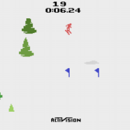
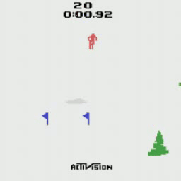
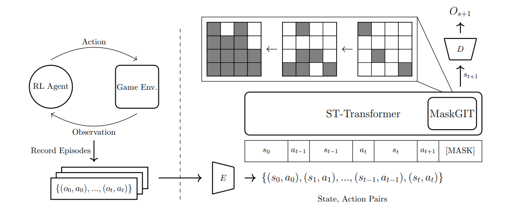

# Neural Game Engine

_Neural network approach for modeling interactive game environments using a VQ-VAE and Spatio-Temporal Transformer. Trained on Atari Skiing gameplay data._

|  |  |
| :---------------------------------: | :-----------------------------: |
|              Original               |          AI Generated           |

## Install

1. Clone Repo

```
git clone https://github.com/AndrewBoessen/neural-game-engine.github
cd neural-game-engine
```

2. Create Conda Environment

```
conda create -n engine python=3.10
conda activate engine
```

3. Install Dependencies

```
pip install -r requirements.txt
```

## Load Checkpoints and Data

### Pretrained Model Checkpoints

Download model checkpoints and move to root directory

|                                          VQ-VAE Checkpoint                                          |                                    Neural Game Engine Checkpoint                                    |
| :-------------------------------------------------------------------------------------------------: | :-------------------------------------------------------------------------------------------------: |
| [Download Here](https://drive.google.com/file/d/1xIec8GLG2CwhUb2dGMrpVb2z1NoUrjHJ/view?usp=sharing) | [Download Here](https://drive.google.com/file/d/1exsjhvskQ48hqWKFC-quVvV3ftBuZ4cW/view?usp=sharing) |

### Gameplay Dataset

The model is trained on a dataset of ~33,000 frames and evaluated on a set of ~8,000 frames.

To train the transformer game-engine model, the dataset is preprocessed and tokenized

https://github.com/user-attachments/assets/b91b7eef-b018-4bfa-99d8-05ac5def9104

#### Download Datasets

|                                          Gameplay Dataset                                           |                                            Token Dataset                                            |
| :-------------------------------------------------------------------------------------------------: | :-------------------------------------------------------------------------------------------------: |
| [Download Here](https://drive.google.com/file/d/1mr900bK0xpwiQskSB4KJvwtrbwtnEJcY/view?usp=sharing) | [Download Here](https://drive.google.com/file/d/19UJVwnnpArB_rG6F4Jn3TTqxKfn04mhD/view?usp=sharing) |
|                                    Extract to `/gameplay_data/`                                     |                                      Extract to `/token_data/`                                      |

## Play

An interactive game script is available that generates frames based on user input

https://github.com/user-attachments/assets/58f30664-9cac-4037-8458-acb96b8ba519

Example gameplay recording. Running on Nvidia RTX 4070 at 15fps

### Run Interactive Game Environment

Follow installation instructions above to install token data and model checkpoints

```
python play.py
```

## Architecture

Full technical report available [here](./assets/technical_report.pdf)



_Interactive Game Engine. An RL agent is used to create a dataset consisting of
observation, action pairs. The observations are encoded into states with the VAE encoder $E$.
The sequential model (ST-Transformer) takes the encoded state, action pairs and predicts
the next state $s_{t+1}$. The state to be predicted, initially represented as a mask token,
$\text{[MASK]}$, is iteratively generated in a non-auto-regressive manner with MaskGIT and bidirectional attention. Predicted states are projected to pixel space with the VAE decoder
$D$._

### Data Collection (RL Agent)

### Image Tokenizer (VQ-VAE)

### Game Engine (ST-Transformer)

