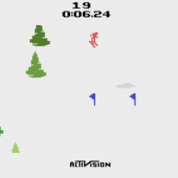

# Neural Game Engine

_Neural network approach for modeling interactive game environments using a VQ-VAE and Spatio-Temporal Transformer. Trained on Atari Skiing gameplay data._

|  |  |
|:-----:|:-----:|
| Original | AI Generated |
